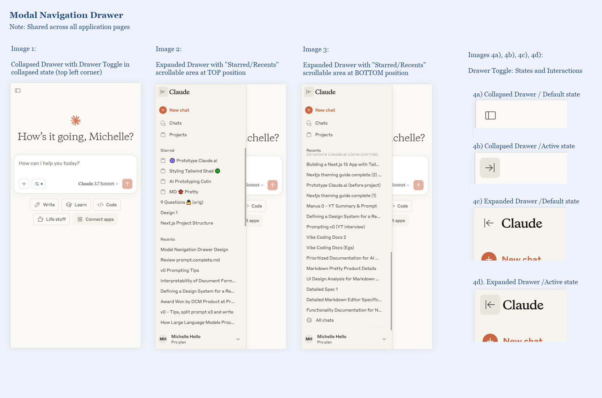

# Prototype Claude

A functional prototype clone of the [Claude.ai](https://claude.ai/) interface and user experience. Created using [v0.dev](https://v0.dev/) as a learning experiment to improve AI prototyping skills.

## Project Goals

- Create a visually accurate clone of the Claude.ai interface
- Implement realistic functionality using Zustand for mock data and state
- Define clean data interfaces that could easily connect to a real backend
- Follow good coding practices with centralised styling and type safety

## Technology Stack

- **Next.js**: React framework with App Router
- **TypeScript**: Static type checking
- **Tailwind CSS**: Utility-first styling
- **shadcn/ui**: UI components ("New York" style, "Stone" palette)
- **Heroicons**: Icon library
- **Next Themes**: Light/dark mode switching
- **Zustand**: State management with persistence

## Priortised Feature Roadmap

Features listed in order of priority for implementation:

| Type | Feature Spec | Description | Reference UI | URL Pattern |
|---------|---------|-------------|-----------|-----------|
| n/a | [Foundational](./agent-docs/features/foundational.md) | Base Next.js project with theming and light/dark mode | n/a | `/` |
| UI | [Navigation](./agent-docs/features/navigation.md) | Modal Drawer Component shared for all pages | [navigation.jpg](agent-docs/reference-ui/navigation.jpg) | n/a |
| Route | [New](./agent-docs/features/new.md) | Starting page for conversations | [new.jpg](agent-docs/reference-ui/new.jpg),  [new-detailed.jpg](agent-docs/reference-ui/new-detailed.jpg)| `/new` |
| Route | [Chat](./agent-docs/features/chat.md) | Conversation with chat messages | [chat.jpg](agent-docs/reference-ui/chat.jpg) | `/chat/{uuid}` |
| Route | [Recents](./agent-docs/features/recents.md) | Lists all chat conversations | [recents.jpg](agent-docs/reference-ui/recents.jpg) | `/recents` |
| Route | [Project](./agent-docs/features/project.md) | A project contains many chats | [project.jpg](agent-docs/reference-ui/project.jpg) | `/project/{uuid}` |
| Route | [Projects](./agent-docs/features/projects.md) | Lists all projects | [projects.jpg](agent-docs/reference-ui/projects.jpg) | `/projects` |
| Route | [Settings](./agent-docs/features/settings.md) | Parent route with shared tab navigation component | N/A | `/settings` (redirects to profile) |
| Route | ↳ Profile  ([settings.md](./features/settings.md)) | User identity and preferences configuration | [settings.jpg](agent-docs/reference-ui/settings.jpg) | `/settings/profile` |
| Route | ↳ Appearance  ([settings.md](./features/settings.md)) | Theme and visual preferences | [settings.jpg](agent-docs/reference-ui/settings.jpg) | `/settings/appearance` |
| Route | ↳ Account  ([settings.md](./features/settings.md)) | Account management and logout | [settings.jpg](agent-docs/reference-ui/settings.jpg) | `/settings/account` |
| Route | ↳ Data Privacy  ([settings.md](./features/settings.md)) | Privacy controls and settings | [settings.jpg](agent-docs/reference-ui/settings.jpg) | `/settings/data-privacy` |

Notes:
1. Individual Chat and Project routes use unique UUIDs, enabling direct access via shareable links.
2. All settings routes share the same feature specification and reference UI as they maintain the same navigation UI with different content areas.

## Out of Scope
- Authentication
- Real-time chat functionality (no AI API integration)
- Backend database (using Zustand instead)

## Development Approach

This app will be generated with [v0.dev](https://v0.dev) using the Claude.ai [interface](https://claude.ai) as a visual reference. See [agent-docs/screenshots](agent-docs/screenshots).

### Data Management

- **Data Interfaces**: Defined early for proper Zustand implementation
- **Client-side State Management**: Uses Zustand and browser storage instead of a database
- **Session Persistence**: Data persists until browser tab closes (no cross-tab persistence)
- **Mock Data**: Initialises with realistic sample data to demonstrate UI functionality
- **Realistic UI**: Simulates complete app behaviour without 3rd party API integrations
- **URL-based Navigation**: Enables direct linking to specific chats and projects via unique URLs (e.g., /chat/[id], /project/[id])

## Success Criteria

### Prototype Quality
- [ ] Convincing Claude.ai interface clone with light/dark mode
- [ ] Realistic interface interactions and user experience

### Workflow Effectiveness
- [ ] Efficient technique for initial app generation
- [ ] Effective agent documentation in `/agent-docs`
- [ ] Reusable documentation templates for future projects
- [ ] Repeatable workflow proven by cloning another web app

### Code Quality
- [ ] Centralised theming with Tailwind and shadcn/ui
- [ ] Modular, well-organised UI components
- [ ] Clean data interfaces ready for backend integration
- [ ] Consistent Zustand state management patterns

### Next Steps: Cursor
- [ ] Import project into Cursor IDE for enhancements and deployment
- [ ] Recreate project in Cursor from scratch as a learning exercise