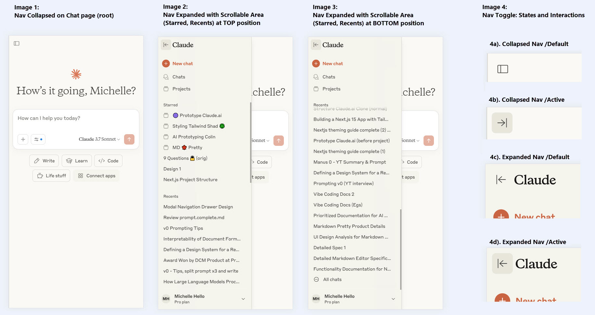

# Prototype Claude

A functional prototype clone of the [Claude.ai](https://claude.ai/) interface and user experience. Created using [v0.dev](https://v0.dev/) as a learning experiment to improve AI prototyping skills.

## Project Goals

- Create a visually accurate clone of the Claude.ai interface
- Implement realistic functionality using Zustand for mock data and state
- Define clean data interfaces that could easily connect to a real backend
- Follow good coding practices with centralised styling and type safety

## Technology Stack

- **Next.js**: React framework with App Router
- **TypeScript**: Static type checking
- **Tailwind CSS**: Utility-first styling
- **shadcn/ui**: UI components ("New York" style, "Stone" palette)
- **Heroicons**: Icon library
- **Next Themes**: Light/dark mode switching
- **Zustand**: State management with persistence

## Core UI Features (and Routing)

| UI | Description | Claude.ai Screenshots | Claude.ai Example Routing |
|---------|-------------|-----------|-----------|
| Navigation | Modal drawer shared across all pages| [navigation.jpg](agent-docs/screenshots/navigation.jpg) | n/a|
| New page | Root page, new chats are started here | [new.jpg](agent-docs/screenshots/new.jpg),  [new-detailed.jpg](agent-docs/screenshots/new-detailed.jpg)| `https://claude.ai/new`|
| Chat page | Thread of chat messages | [chat.jpg](agent-docs/screenshots/chat.jpg) | `https://claude.ai/chat/afec3c19-17d2-45c0-ba5b-d93a8e04e390`|
| Recents page | Lists all chat conversations | [recents.jpg](agent-docs/screenshots/recents.jpg) | `https://claude.ai/recents`|
| Project page | A project contains many chats | [project.jpg](agent-docs/screenshots/project.jpg) | `https://claude.ai/project/01968c4c-69b2-71e8-9342-3cae65916336`|
| Projects page | Lists all projects | [projects.jpg](agent-docs/screenshots/projects.jpg) | `https://claude.ai/projects`|
| Settings page:  Profile| Set full name, custom instruction, etc. | [settings.jpg](agent-docs/screenshots/settings.jpg) | `https://claude.ai/settings/profile`  Note: `/settings/` implements server-side redirect to `/settings/profile`|
| Settings page:  Appearance | Set light/dark mode, chat font | [settings.jpg](agent-docs/screenshots/settings.jpg) | `https://claude.ai/settings/appearance`|
| Settings page:  Account | Logout, Delete account | [settings.jpg](agent-docs/screenshots/settings.jpg) | `https://claude.ai/settings/account`|
| Settings page:  Data Privacy Controls | Statement, location, etc. | [settings.jpg](agent-docs/screenshots/settings.jpg) | `https://claude.ai/settings/data-privacy-controls`|

Routing Note (UUID):
- Every Chat and Project has an unique url (UUID)
- Meaning a chat and project is accessible via a direct link

## Out of Scope
- Authentication
- Real-time chat functionality (no AI API integration)
- Backend database (using Zustand instead)

## Development Approach

This app will be generated with [v0.dev](https://v0.dev) using the Claude.ai [interface](https://claude.ai) as a visual reference. See [agent-docs/screenshots](agent-docs/screenshots).

### Data Management

- **Data Interfaces**: Defined early for proper Zustand implementation
- **Client-side State Management**: Uses Zustand and browser storage instead of a database
- **Session Persistence**: Data persists until browser tab closes (no cross-tab persistence)
- **Mock Data**: Initialises with realistic sample data to demonstrate UI functionality
- **Realistic UI**: Simulates complete app behaviour without 3rd party API integrations
- **URL-based Navigation**: Enables direct linking to specific chats and projects via unique URLs (e.g., /chat/[id], /project/[id])

## Success Criteria

### Prototype Quality
- [ ] Convincing Claude.ai interface clone with light/dark mode
- [ ] Realistic interface interactions and user experience

### Workflow Effectiveness
- [ ] Efficient technique for initial app generation
- [ ] Effective agent documentation in `/agent-docs`
- [ ] Reusable documentation templates for future projects
- [ ] Repeatable workflow proven by cloning another web app

### Code Quality
- [ ] Centralised theming with Tailwind and shadcn/ui
- [ ] Modular, well-organised UI components
- [ ] Clean data interfaces ready for backend integration
- [ ] Consistent Zustand state management patterns

### Next Steps: Cursor
- [ ] Import project into Cursor IDE for enhancements and deployment
- [ ] Recreate project in Cursor from scratch as a learning exercise