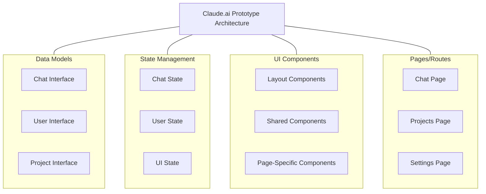

# Building a Claude.ai Prototype: Iterative Development Strategy

Based on your goals and tech stack, I recommend an iterative approach that balances structure with flexibility. Here's my advice for structuring your development process:

## Start with a Solid Foundation

Begin with a focused, well-structured initial setup that includes:

1. **Project scaffolding** with proper Next.js App Router structure
2. **Core UI components** and theme setup (shadcn/ui with New York style and Stone palette)
3. **Basic state management** structure with Zustand
4. **Type definitions** for your core data models


This gives you a solid foundation without overwhelming yourself with implementation details.

## Recommended Initial Approach

### 1. Create a Project Structure Document First

Before coding, create a project overview document that outlines:



### 2. Implement in Feature Slices

I strongly recommend the "feature slices" approach you mentioned. This allows you to:

- Focus on one complete feature at a time
- See tangible progress with each iteration
- Test and refine as you go


### 3. Initial Prompt Structure

Your initial prompt should include:

1. **Project Overview**: Brief description of the Claude.ai prototype
2. **Tech Stack**: Next.js, TypeScript, shadcn/ui, Tailwind, Zustand
3. **Core Requirements**:

1. Project structure following App Router conventions
2. Theme setup with shadcn/ui (New York style, Stone palette)
3. Basic responsive layout matching Claude.ai
4. Initial state management setup


4. **First Feature Slice**: The chat interface (most central feature)
5. **Screenshots**: Include the main chat interface screenshot only


## Recommended Project Structure

```plaintext
/app
  /layout.tsx           # Main layout with shared navigation
  /(routes)
    /page.tsx           # Main chat page
    /chats/page.tsx     # Chats listing
    /projects/page.tsx  # Projects listing
    /settings/page.tsx  # User settings
/components
  /ui                   # shadcn components
  /layout               # Layout components (Sidebar, Header, etc.)
  /chat                 # Chat-specific components
  /projects             # Project-specific components
/lib
  /store               # Zustand store
    /chat-store.ts     # Chat state
    /user-store.ts     # User state
    /ui-store.ts       # UI state (sidebar open/closed, etc.)
  /types               # TypeScript interfaces
    /chat.ts           # Chat interfaces
    /user.ts           # User interfaces
    /project.ts        # Project interfaces
/docs
  /features            # Feature documentation
    /chat.md           # Chat feature requirements
    /projects.md       # Projects feature requirements
  /project-overview.md # Overall project structure and goals
  /good-practices.md   # Coding standards and practices
```

## Iterative Development Plan

1. **Iteration 1**: Project setup, theme configuration, and basic layout
2. **Iteration 2**: Main chat interface with mock responses
3. **Iteration 3**: Chat history and navigation
4. **Iteration 4**: Projects interface
5. **Iteration 5**: Settings interface
6. **Iteration 6**: Shared modal drawer navigation
7. **Iteration 7**: Polish and refinement


## Sample Initial Prompt

Here's a template for your initial prompt:

```plaintext
I want to create a functional prototype of Claude.ai using Next.js, TypeScript, shadcn/ui, and Tailwind CSS. The prototype should look and feel like the real Claude.ai but will return a fixed response: "This is a prototype that feels like real, but isn't."

Please set up the initial project with:

1. Next.js App Router structure
2. shadcn/ui with New York style and Stone color palette
3. Basic Zustand store setup with sessionStorage middleware
4. Core TypeScript interfaces for chats, users, and projects
5. Main chat interface matching the provided screenshot

[Attach main chat screenshot]

For the first iteration, focus on the main chat interface with proper layout and styling. No need to implement all features yet - we'll build iteratively.
```

This approach gives you a solid foundation while allowing for iterative development, making the project more manageable and less overwhelming.