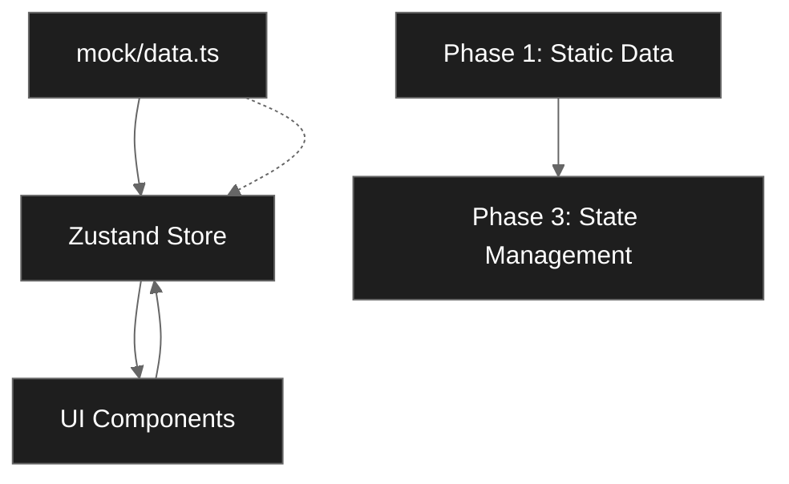

### Claude.ai Prototype Development Strategy Recommendations

Based on your project requirements and the Claude.ai interface screenshot you've shared, I'll provide recommendations for your development approach.

## Development Strategy Recommendation

I recommend **Option 3: Feature-based implementation** with elements of Option 1's incremental approach. Here's why:

1. **Documentation-first approach** creates a clear roadmap and architecture before coding begins
2. **Incremental feature implementation** allows you to build a solid foundation and add complexity gradually
3. **User stories** help maintain focus on user experience, which is critical for a UI-focused prototype
4. **Prioritization** ensures core functionality is implemented first, with less critical features added later


This approach provides structure while maintaining flexibility, which is ideal for a complex UI project like a Claude.ai clone.

## Initial Prompt Context

For your initial prompt to v0.dev, I recommend including:

1. **Project overview** - Brief description of the Claude.ai prototype project
2. **Core design requirements** - Shadcn New York theme, Stone palette, Tailwind approach
3. **Initial feature focus** - Start with the main chat interface
4. **Visual reference** - Include the screenshot you shared for visual guidance
5. **TypeScript interfaces** - Include basic data models for messages, conversations, etc.


Keep the initial prompt focused on establishing the foundation - the main chat interface and core styling. This gives v0 a clear, manageable scope.

## Optimal Project Structure

I recommend structuring your project as follows:

```txt
.
├── docs/                       # Project documentation
│   ├── user-stories.md         # Requirements from user perspective
│   ├── architecture.md         # System design and structure
│   └── coding-standards.md     # Code style and best practices
│
├── app/                        # Main application code (Next.js App Router)
│   └── (routes)/               # Route groups for organizing pages
│       ├── chat/page.tsx       # Chat feature page component
│       ├── projects/page.tsx   # Projects feature page component
│       └── settings/page.tsx   # Settings feature page component
│
├── lib/                        # Shared library code
│   ├── store/                  # State management
│   ├── types/                  # TypeScript type definitions
│   └── utils/                  # Utility functions and helpers
│
└── components/                 # Reusable UI components
    ├── ui/                     # Generic UI elements
    └── features/               # Feature-specific components
        ├── chat/               # Chat feature components
        ├── projects/           # Project feature components
        └── navigation/         # Navigation components
```

This structure:

- Separates documentation from code
- Organizes routes according to Next.js App Router conventions
- Groups components by feature domain
- Isolates shared utilities and types

## Implementation Plan

### 1. Phase 1: Foundation
- Set up project with Next.js, TypeScript, Tailwind, and shadcn/ui
- Implement Stone color palette and New York theme
- Create basic layout structure with navigation drawer

### 2. Phase 2: Core Chat Interface
- Build the main chat UI components
- Implement message display and input
- Add mock response functionality

### 3. Phase 3: State Management
- Set up Zustand store for chat history
- Implement session storage persistence
- Create TypeScript interfaces for all data models

### 4. Phase 4: Additional Pages
- Build chat history/listing page
- Implement projects page and project detail page
- Create settings page

### 5. Phase 5: Polish
- Add transitions and animations
- Implement responsive design adjustments
- Add loading states and error handling

## Key Considerations

- **Styling Consistency**: Create a theme configuration file early to ensure consistent application of the Stone palette
- **Component Reusability**: Design components with reuse in mind, especially for the chat interface elements
- **Mobile-First**: Start with mobile layouts and expand to desktop for true mobile-first development
- **State Management**: Keep your Zustand store simple initially, then expand as needed
- **TypeScript Interfaces**: Define these early to ensure type safety throughout development

## Short Q&A (x3)

```
1. Which development strategy would you recommend?
```

Option 3 (Feature-based) with elements of Option 1's incremental approach provides the best balance of structure and flexibility.

```
2. How much context should I provide in the initial prompt to v0.dev?
```

Provide focused context on the immediate task (e.g., "Create the main chat interface for a Claude.ai clone using shadcn/ui with Stone palette") along with visual references. Too much context can dilute the focus.

```
3. What's the optimal way to structure this work to maintain clarity while building iteratively?
```

Use the feature-based folder structure outlined above, with clear separation of concerns. Document your architecture decisions and user stories before coding. Implement one feature at a time, starting with the core chat interface.

## Q4. Modal drawer first, sure?

```
The modal navigation drawer displays recent chats and projects. Shall I still implement it in phase 1?
```

Yes, I recommend implementing the modal navigation drawer in Phase 1, but with a strategic approach:

Phase 1 Navigation Drawer Implementation

1. **Basic Structure First**: Implement the drawer component itself with the correct styling, positioning, and animations to match Claude.ai's look and feel.
2. **Static Content Initially**: Use hardcoded placeholder data for recent chats and projects rather than connecting to state management right away.
3. **Layout Integration**: Ensure the drawer works properly with the overall layout and can be opened/closed from all pages.


This approach gives you several advantages:

- **Early UI Consistency**: The navigation drawer is a core UI element that appears across all pages, so implementing it early establishes visual consistency.
- **Separation of Concerns**: You can build the UI structure without waiting for state management to be fully implemented.
- **Incremental Complexity**: Start with static content, then connect to Zustand state in Phase 3 when you implement state management.


When you reach Phase 3 (State Management), you'll replace the static content with dynamic data from your Zustand store. This creates a natural progression:

1. Phase 1: Static drawer UI with placeholder data
2. Phase 3: Connect drawer to state management for dynamic content


This approach maintains the incremental development strategy while ensuring that core navigation elements are in place from the beginning.

## Q5. Hardcode mock data?

```
Shall I hard code this data in the ui components itself or ask for it to be defined in a separate file? What do I instruct ? What will make moving to state management easier?
```

### Define Mock Data in Separate Files

I strongly recommend defining your mock data in separate files rather than hardcoding it directly in UI components. This approach will make the transition to state management significantly easier and follows best practices for maintainable code.

### Implementation Approach

Below Diagram: Mock Data to State Management Transition



### Instructions for v0.dev

```txt
Create a navigation drawer component for a Claude.ai clone that imports mock data from a separate file. The drawer should display recent chats and projects.
```

### File Structure to Request

1. **Mock Data File**:

```typescript
// lib/mock/navigation-data.ts

export const mockChats = [
  { id: '1', title: 'Chat about project planning', preview: 'Let me help you plan your project...', timestamp: '2023-05-10T14:30:00Z' },
  // More mock chats...
];

export const mockProjects = [
  { id: '1', title: 'Website Redesign', description: 'Planning for company website overhaul', timestamp: '2023-05-08T10:15:00Z' },
  // More mock projects...
];
```

2. **Navigation Drawer Component**:

```typescript
// components/features/navigation/drawer.tsx

import { mockChats, mockProjects } from '@/lib/mock/navigation-data';

// Component implementation that uses the mock data
```

### Benefits of This Approach

**Easier State Management Transition**
- When you implement Zustand in Phase 3, you'll only need to:
  - Create your store with similar data structure to your mock data
  - Update import statements in components (from mock data to store hooks)
  - No need to refactor component logic that renders the data

**Better Separation of Concerns**
- UI components focus on rendering, not data definition
- Data structure is defined once in a central location
- Changes to data structure only need to happen in one place

**Facilitates Testing**
- Components can be tested with different mock data sets
- State management can be tested independently of UI

**Cleaner Component Code**
- Components remain focused on their primary responsibility (rendering UI)
- Improved readability and maintainability

When you transition to Zustand in Phase 3, your store structure can mirror your mock data structure, making the switch nearly seamless:

```typescript
// lib/store/navigation-store.ts

import { create } from 'zustand';
import { persist } from 'zustand/middleware';
import { mockChats, mockProjects } from '@/lib/mock/navigation-data'; // Import initial data

export const useNavigationStore = create(
  persist(
    (set) => ({
      chats: mockChats, // Initialize with mock data
      projects: mockProjects, // Initialize with mock data
      // Add actions to update state
      addChat: (chat) => set((state) => ({ chats: [chat, ...state.chats] })),
      // More actions...
    }),
    {
      name: 'navigation-storage',
    }
  )
);
```

This approach gives you a clear migration path from static data to state management while maintaining good software engineering practices.

## Q6. What to put in `Docs/`

```
Given the 'docs/' directory approach for the Claude.ai prototype project, refine the documentation strategy for optimal clarity and effectiveness for both the AI coding agent and myself. The goal is to create a well-structured, maintainable, and easily navigable documentation set. Consider the following:

1.  **'good-practices.md'**: Determine the optimal structure for this file. Should it be a single comprehensive document covering Tailwind CSS, UI components, theming, Zustand, and modern Next.js practices, or should it be broken down into smaller, more focused files?

2.  **Feature-Specific Files**: For each feature (e.g., Main Chat Interface, Chat History Page), should there be a dedicated file? If so, what content should each file include? Consider user stories, architecture diagrams, and detailed user flows.

3.  **Core Reference Document**: Should a central document be maintained to tie all documentation together? If so, what should it contain? Consider feature prioritization, numbered user stories (e.g., '[ ]' for to-do, '[x]' for done), and links to relevant feature files.

4.  **Project Overview/PRD**: Should a comprehensive Project Requirements Document (PRD) or overview file be created? If so, what should it detail? Consider the full solution overview, user flows, and the chosen tech stack.

5.  **'docs/' Directory Structure**: Based on the above considerations, propose the final structure for the 'docs/' directory, including file names and a brief description of the content for each file. The goal is to balance comprehensiveness with simplicity, ensuring the documentation is easy to understand, maintain, and reference during development. Provide a clear and concise structure that facilitates iterative development and collaboration with the AI coding agent.
```

### Recommended Project Structure

Based on your requirements, I've designed a comprehensive documentation structure that balances clarity, maintainability, and usability for both you and AI coding agents.

```txt
.
├── docs/                       # Project documentation
│   ├── user-stories.md         # Requirements from user perspective
│   ├── architecture.md         # System design and structure
│   └── coding-standards.md     # Code style and best practices
│
├── app/                        # Main application code (Next.js App Router)
│   └── (routes)/               # Route groups for organizing pages
│       ├── chat/page.tsx       # Chat feature page component
│       ├── projects/page.tsx   # Projects feature page component
│       └── settings/page.tsx   # Settings feature page component
│
├── lib/                        # Shared library code
│   ├── store/                  # State management
│   ├── types/                  # TypeScript type definitions
│   └── utils/                  # Utility functions and helpers
│
└── components/                 # Reusable UI components
    ├── ui/                     # Generic UI elements
    └── features/               # Feature-specific components
        ├── chat/               # Chat feature components
        ├── projects/           # Project feature components
        └── navigation/         # Navigation components
```

### Detailed Doc Breakdown

#### 1. Project Documentation (`/docs/project/`)

##### `project-overview.md`

- **Purpose**: Serves as the PRD and central reference document
- **Content**:
   - Project goals and objectives
   - Target user experience
   - Technical requirements
   - Tech stack overview with justifications
   - High-level feature list with priorities
   - Implementation phases
   - Links to all other documentation

##### `roadmap.md`

- **Purpose**: Development timeline and progress tracking
- **Content**:
   - Prioritized feature list with checkboxes `[ ]` for tracking
   - Development phases with clear milestones
   - Dependencies between features
   - Current status indicators

##### `architecture.md`

- **Purpose**: Technical architecture documentation
- **Content**:

   - Application structure diagram
   - Data flow diagrams
   - Component hierarchy
   - State management approach
   - File/folder organization

#### 2. Feature Documentation (`/docs/features/`)

Each feature gets its own dedicated file with a consistent structure:

##### Feature File Template (e.g., `chat-interface.md`)

- **Purpose**: Comprehensive documentation for a specific feature
- **Content**:
   - Feature overview and purpose
   - User stories (numbered for reference)
   - UI/UX requirements with references to screenshots
   - Component breakdown
   - State requirements
   - API/data requirements
   - Implementation notes
   - Acceptance criteria

#### 3. Guidelines (`/docs/guidelines/`)

##### `coding-standards.md`

- **Purpose**: General coding practices and standards
- **Content**:
   - Code formatting and style guidelines
   - File naming conventions
   - Import ordering
   - Component structure
   - Error handling patterns
   - Testing approach

##### `ui-guidelines.md`
- **Purpose**: UI-specific standards and patterns
- **Content**:
   - Tailwind usage patterns
   - shadcn/ui component usage
   - Stone color palette reference
   - Typography system
   - Spacing system
   - Responsive design patterns
   - Accessibility requirements

##### `state-management.md`
- **Purpose**: Zustand implementation guidelines
- **Content**:
   - Store structure
   - Action patterns
   - Persistence configuration
   - State access patterns
   - TypeScript integration

##### `typescript-patterns.md`

- **Purpose**: TypeScript usage guidelines
- **Content**:
   - Interface definitions
   - Type utility patterns
   - Generic usage
   - Type safety best practices

#### 4. Assets (`/docs/assets/`)

- **Purpose**: Visual references and diagrams
- **Content**:
   - UI screenshots organized by feature
   - Architecture diagrams
   - User flow diagrams
   - Color palette references

### Rationale for This Structure

1. **Separation of Concerns**: By dividing documentation into project, features, guidelines, and assets, each document has a clear purpose and scope.
2. **Progressive Detail**: Documentation flows from high-level (project overview) to specific implementation details (feature docs and guidelines).
3. **Maintainability**: Smaller, focused files are easier to update than large monolithic documents.
4. **AI-Friendly Structure**: Clear file naming and consistent document structure makes it easier for AI coding agents to locate and understand requirements.
5. **Development Workflow Support**: The structure supports an iterative development approach, with clear tracking of progress and priorities.


### Sample Content for Key Files

#### Example: `project-overview.md`

```markdown
# Claude.ai Prototype Project Overview

## Project Goal
Create a visually accurate, interactive prototype of Claude.ai that mimics the real application's look and feel without implementing actual AI functionality.

## Tech Stack
- Next.js (App Router)
- TypeScript
- shadcn/ui components
- Tailwind CSS
- Zustand (for state management)

## Core Features
1. [P0] Main chat interface
2. [P0] Navigation drawer
3. [P1] Chat history/listing page
4. [P1] Projects page
5. [P2] Project detail page
6. [P2] User settings page

## Implementation Phases
1. **Foundation** - Project setup, theming, navigation structure
2. **Core Chat Interface** - Main chat UI and mock responses
3. **State Management** - Zustand implementation and persistence
4. **Additional Pages** - History, projects, and settings pages
5. **Polish** - Animations, responsive refinements, error states

## Documentation Index
- [Development Roadmap](/docs/project/roadmap.md)
- [Technical Architecture](/docs/project/architecture.md)
- [Feature Documentation](/docs/features/)
- [Development Guidelines](/docs/guidelines/)
```

#### Example: `chat-interface.md`

```markdown
# Chat Interface Feature Documentation

## Overview
The main chat interface is the primary interaction point for users. It should visually match the Claude.ai interface while providing mock AI responses.

## User Stories
1. [US-CHAT-01] As a user, I want to type messages in an input field and send them to the chat.
2. [US-CHAT-02] As a user, I want to see my messages displayed in the chat history.
3. [US-CHAT-03] As a user, I want to receive mock responses to my messages.
4. [US-CHAT-04] As a user, I want to see typing indicators when the system is "thinking".
5. [US-CHAT-05] As a user, I want to clear the current conversation.

## UI Requirements
- Message input field at bottom of screen
- Send button that activates when text is entered
- Chat history displays in chronological order
- User messages right-aligned with Stone-600 background
- System messages left-aligned with white background and Stone-300 border
- Typing indicator animation matches Claude.ai

## Component Breakdown
- ChatContainer (main wrapper)
- MessageList (scrollable container for messages)
- MessageItem (individual message with user/system styling)
- TypingIndicator (animated dots during "thinking")
- MessageInput (text input and send button)

## State Requirements
- Current conversation messages
- Input field text
- Typing/thinking state

## Implementation Notes
- All system responses should return: "This is a prototype that feels like real, but isn't"
- Add 1-2 second delay before showing system response to simulate thinking
- Ensure proper scrolling behavior when new messages are added

## Screenshots
- [Chat Interface Overview](/docs/assets/ui-screenshots/chat-interface-overview.png)
- [Message Types](/docs/assets/ui-screenshots/message-types.png)
```

### Recommendations for Working with AI Coding Agents

1. **Reference Documentation Explicitly**: When working with v0.dev, explicitly reference the relevant documentation files in your prompts.
2. **Provide Context Incrementally**: Start with high-level requirements, then add specific details from feature documentation as needed.
3. **Use Consistent Terminology**: Maintain consistent naming across all documentation to avoid confusion.
4. **Link to Visual References**: Always reference relevant screenshots or diagrams when describing UI components.
5. **Update Documentation Iteratively**: As development progresses, update documentation to reflect the current state of the project.

This documentation structure provides a comprehensive yet flexible framework that will support your development process while making collaboration with AI coding agents more effective.

## Q7. About User Stories

### Template

Here's a comprehensive yet efficient user story template designed specifically for your Claude.ai prototype project:

```markdown
## [US-ID] User Story Title

### Story
As a [user type (who)],
I want to [action/capability (what)],
so that [benefit/value (why)].

### Acceptance Criteria

[Specific, testable conditions that must be met for the story to be considered complete. Use checkboxes for easy progress tracking.]

- [ ] Criterion 1
- [ ] Criterion 2
- [ ] Criterion 3

### Technical Notes

[Brief technical details relevant to implementation, focusing on what developers need to know.]

- Implementation details
- Component dependencies
- State requirements

### UI/UX Specifications

[Visual and interaction requirements specific to this prototype project.]

- Visual requirements
- Interaction patterns
- Responsive behavior

### References

[Links to relevant design assets or related user stories.]

- [Design screenshot](/path/to/screenshot)
- [Related user story](#US-ID)
```

### Examples

#### Example 1: Chat Message Input

```markdown
## [US-CHAT-01] Send Chat Messages

### Story
As a user,
I want to type messages and send them to the chat,
so that I can interact with the Claude.ai prototype.

### Acceptance Criteria
- [ ] Input field is displayed at the bottom of the chat interface
- [ ] Send button is disabled when input is empty
- [ ] Send button is enabled when text is entered
- [ ] Messages are sent when the user clicks the send button
- [ ] Messages are sent when the user presses Enter
- [ ] Input field is cleared after sending a message

### Technical Notes
- Store message in Zustand state before displaying
- Add message to current conversation history
- Trigger mock response after sending

### UI/UX Specifications
- Input field has Stone-100 background
- Input field expands vertically to accommodate multiple lines
- Send button uses Stone-600 color when active
- Mobile keyboard should not obscure the input field

### References
- [Chat input design](/docs/assets/ui-screenshots/chat-input.png)
- [Related to message display](#US-CHAT-02)
```

#### Example 2: Navigation Drawer

```markdown
## [US-NAV-01] Access Navigation Drawer

### Story
As a user,
I want to access a navigation drawer showing recent chats and projects,
so that I can quickly navigate between different conversations and project areas.

### Acceptance Criteria
- [ ] Navigation drawer can be opened by clicking the menu icon
- [ ] Drawer displays a list of recent chats
- [ ] Drawer displays a list of projects
- [ ] Selecting a chat navigates to that conversation
- [ ] Selecting a project navigates to that project detail
- [ ] Drawer can be closed by clicking outside or the close button

### Technical Notes
- Drawer state (open/closed) stored in local component state
- Chat and project lists initially from mock data, later from Zustand
- Navigation handled through Next.js router

### UI/UX Specifications
- Drawer slides in from left side
- Overlay dims main content when drawer is open
- Recent chats show title and preview text
- Projects show title and last modified date
- Active item highlighted with Stone-200 background

### References
- [Navigation drawer design](/docs/assets/ui-screenshots/navigation-drawer.png)
- [Related to chat history](#US-CHAT-03)
```

### Best Practices

1. **Consistent Numbering**: Use a consistent ID format that includes the feature area (CHAT, NAV, PROJ, SET)
2. **Appropriate Detail Level**: Include enough detail to guide implementation without over-specifying
3. **Testable Criteria**: Ensure acceptance criteria are specific and testable
4. **Visual References**: Always link to relevant screenshots or mockups
5. **Dependencies**: Note relationships between user stories when applicable
6. **Priority Indicators**: Consider adding priority levels (P0, P1, P2) to help with planning
7. **Status Tracking**: Use checkboxes to track progress on acceptance criteria


This template provides a structured yet flexible approach to documenting user requirements for your Claude.ai prototype, making it easier to communicate with AI coding agents and track development progress.